# MultiAgent Architecture

This document captures the end-to-end verification workflow implemented by the MultiAgent tool.

```mermaid
flowchart TD
  A[Input: Requirement ID / Name / Source Snippet] --> B[Requirement Intake Agent]

  B --> C[Repo Discovery Agent]
  C --> D[Requirement Parsing Agent]
  D --> E[Source + Dictionary Mapping Agent]

  E --> F[Verification Strategy Agent]
  F --> G{Mode Selection}

  G -->|Direct| H1[Direct Verification Builder]
  G -->|Hybrid| H2[Hybrid Verification Builder]
  G -->|Manual| H3[Manual Review Builder]

  H1 --> I[Draft Artifact Generator]
  H2 --> I
  H3 --> I

  I --> J[Generated Drafts]
  J --> J1[Verification DD]
  J --> J2[RVSTest / Harness]
  J --> J3[Python Testcases]
  J --> J4[Traceability Notes]

  J --> K[Human Review Gate]
  K -->|Approved| L[Test Execution Agent]
  K -->|Rejected| I

  L --> M[Test Logs + Coverage Results]
  M --> N{Pass + Coverage + Requirement Evidence?}

  N -->|Yes| O[Proof & Traceability Reporter]
  O --> P[Output: Verified Suite + Evidence Package]

  N -->|No| Q[Failure Triage Agent]
  Q --> R[Failure Classification]
  R --> R1[Test Setup Issue]
  R --> R2[DD Mapping Issue]
  R --> R3[Harness Issue]
  R --> R4[Source Defect]
  R --> R5[Requirement Ambiguity]
  R --> R6[Coverage Gap]

  R --> S[Suggested Fix Report]
  S --> K

  R4 --> T[Output: Failed Suite - Needs Developer Fix]

  P --> U[Learning Agent]
  T --> U
  U --> V[Learning Memory + Run History]
```

## Architecture Summary

The system is organized as a strict verification pipeline:

1. Intake the requirement ID, name, or source snippet.
2. Discover the repository evidence needed to verify it.
3. Parse the requirement text and extract bolded terms.
4. Map source terms, dictionaries, and verification fields.
5. Choose the verification mode.
6. Generate draft artifacts.
7. Present a human review gate.
8. Execute the approved verification package.
9. Collect logs, coverage, and evidence.
10. Report proof or triage failures with a classification.
11. Record the run in the learning memory store for future retrieval and improvement.

## Mode Behavior

- **Direct**
  - Used when the requirement interface maps directly to function parameters and outputs.
  - Produces `Data_dictionary.csv`, `uut_dictionary.csv`, and Python testcases.

- **Hybrid**
  - Used when the requirement needs RVSTest setup, pointer handling, stubs, or internal helpers.
  - Produces `Data_dictionary.csv`, `verification.rvstest`, and Python testcases.

- **Manual**
  - Used when the verification must be driven directly from RVSTest vectors.
  - Produces manual RVSTest procedures and supporting notes.

## Learning Agent

The dedicated Learning Agent records:

- successful verified runs as reusable examples
- blocked runs as negative examples
- failed runs with classification and suggested fixes
- repository evidence patterns for future retrieval

The learning memory is stored alongside the run output in:

- `learning/run_history.jsonl`
- `learning/gold_examples.jsonl`
- `learning/failure_examples.jsonl`
- `learning/learning_summary.md`

## Failure Policy

The tool is intentionally strict:

- If the requirement cannot be resolved from the repo, the run blocks.
- If the repo root is incorrect, the run blocks.
- If there is no evidence to support verification, the run blocks.
- No fake success artifacts are generated for unresolved requirements.

## Output Package

A successful run can generate:

- `Data_dictionary.csv`
- `uut_dictionary.csv`
- `verification.rvstest`
- `test_requirement_generated.py`
- `traceability_notes.md`
- `rapita/rvsconfig.xml`
- `rapita/rapita-node-mapping.md`
- `proof_report.md`
- `learning/run_history.jsonl`
- `learning/gold_examples.jsonl`
- `learning/failure_examples.jsonl`
- `learning/learning_summary.md`
