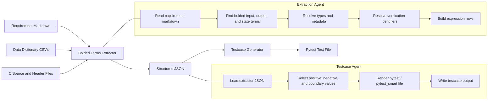

# Bolded Terms Extractor and Testcase Generator

This repository contains two Python agents that work together to turn requirement markdown into structured testcase output.

## What The Agents Do

### 1. Bolded Terms Extractor

File: [`bolded_terms_extractor.py`](./bolded_terms_extractor.py)

This agent:
- Reads requirement markdown files
- Extracts bolded input, output, and state terms
- Resolves types from the data dictionary CSV files
- Resolves verification identifiers from the C source and header files
- Builds expression rows from the requirement text
- Prints human-readable tables
- Exports structured JSON for downstream processing

### 2. Testcase Generator

File: [`testcase_generator_agent.py`](./testcase_generator_agent.py)

This agent:
- Consumes the JSON produced by the extractor
- Selects positive, negative, and boundary-style testcase values
- Generates a Python testcase file in `pytest` and `pytest_smart` format
- Emits `FW.Set()`, `FW.Run()`, and `FW.Verify()` calls
- Writes the generated testcase file to the chosen output directory

## Technical Stack

- Python 3
- Python standard library only for the agents
- Markdown requirement files
- CSV data dictionaries
- C header and source files for verification mapping
- `pytest`
- `pytest_smart`


## Architecture



## Commands

### 1. Extract a single requirement

```bash
python3 bolded_terms_extractor.py \
  --file requirements/LLR/FAF-LLR-491.md \
  --resolve-types \
  --resolve-verification \
  --output /private/tmp/faf_llr_491.json
```

### 1b. Extract many requirements in parallel

```bash
python3 bolded_terms_extractor.py \
  --all \
  --resolve-types \
  --resolve-verification \
  --per-file-output-dir /private/tmp/extracted-json \
  --workers 8
```

### 2. Extract by requirement ID

```bash
python3 bolded_terms_extractor.py \
  --requirement-id FAF-LLR-491 \
  --resolve-types \
  --resolve-verification \
  --output /private/tmp/faf_llr_491.json
```

### 3. Generate a testcase file

```bash
python3 testcase_generator_agent.py \
  --input /private/tmp/faf_llr_491.json \
  --output-dir ~/Downloads \
  --output-name test_FAF_LLR_491.py
```

### 3b. Generate many testcase files in parallel

```bash
python3 testcase_generator_agent.py \
  --input-dir /private/tmp/extracted-json \
  --output-dir ~/Downloads \
  --workers 8
```

### 4. Run both steps for a new requirement

```bash
python3 bolded_terms_extractor.py \
  --file requirements/LLR/FAF-LLR-490.md \
  --resolve-types \
  --resolve-verification \
  --output /private/tmp/faf_llr_490.json

python3 testcase_generator_agent.py \
  --input /private/tmp/faf_llr_490.json \
  --output-dir ~/Downloads \
  --output-name test_FAF_LLR_490.py
```

### 5. Run the full pipeline with one command

```bash
python3 run_pipeline.py \
  --all \
  --resolve-types \
  --resolve-verification \
  --json-dir /private/tmp/extracted-json \
  --output-dir ~/Downloads \
  --workers 8 \
  --component-name LLR
```

## Output Format

### Extractor Output

The extractor prints and exports:
- Inputs table
- Outputs table
- State table
- Expressions table
- Verification identifiers
- Type metadata such as:
  - min and max values
  - enum values
  - pointer values
  - array subtype and length
  - timing intervals
  - string length and valid string range

### Generator Output

The testcase generator writes a Python file that follows the project template:

```python
# Item ID: FAF-LLR-491

import pytest
import pytest_smart as smart


@pytest.fixture(autouse=True)
def setUp(FW: smart.FW):
    FW.Set_Component("LLR")
    FW.Reset()
```

It then adds testcase functions with:
- `FW.Id()`
- `FW.Set()`
- `FW.Run()`
- `FW.Verify()`

## How The Generator Chooses Test Values

The generator uses the resolved type metadata to select values such as:
- Boolean: `True`, `False`
- Integer: nominal, minimum, maximum, and invalid out-of-range values
- Float: nominal, minimum, maximum, and invalid out-of-range values
- Enumeration: listed enum values
- Pointer: `object()` for valid, `None` for invalid
- Array: representative array contents and length-related cases
- String: valid and invalid string values based on metadata

For numeric inputs where `min = 0`, the invalid lower-bound testcase uses `-1` rather than duplicating `0`.
The testcase generator is utility-agnostic and can be pointed at different requirement families by changing the resolved input metadata and, when needed, the component name.

## Notes

- The extractor and testcase generator are intentionally heuristic-driven.
- Queue examples are included in this repository, but the generator is designed to reuse the same flow for other utilities.
- The repository does not currently use a Python packaging file such as `pyproject.toml`.

## Example Workflow

```bash
python3 bolded_terms_extractor.py \
  --file requirements/LLR/FAF-LLR-491.md \
  --resolve-types \
  --resolve-verification \
  --output /private/tmp/faf_llr_491.json

python3 testcase_generator_agent.py \
  --input /private/tmp/faf_llr_491.json \
  --output-dir ~/Downloads \
  --output-name test_FAF_LLR_491.py
```
