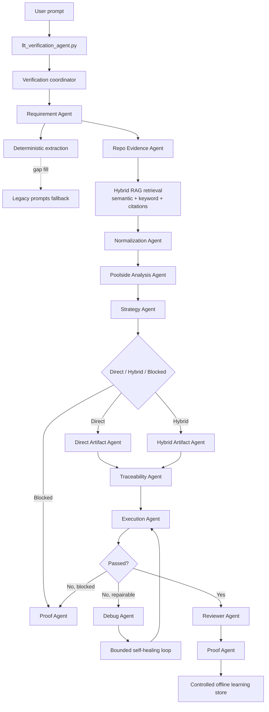
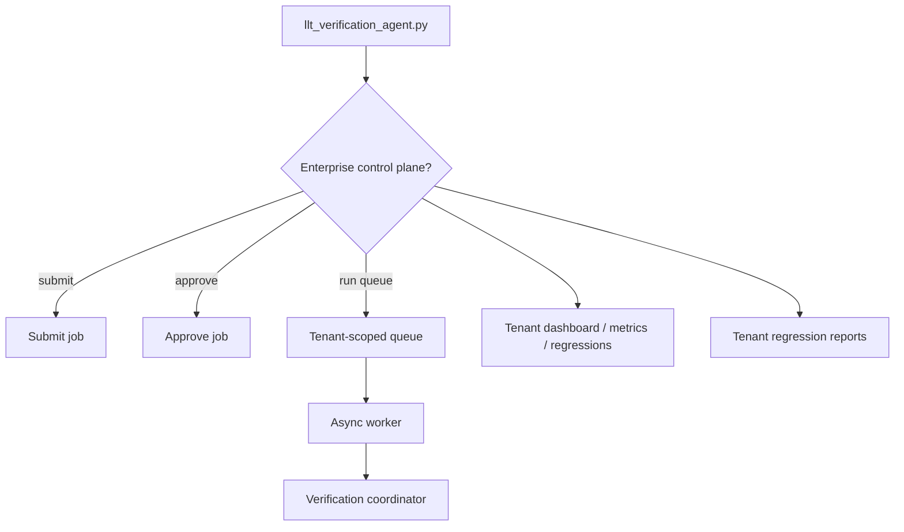
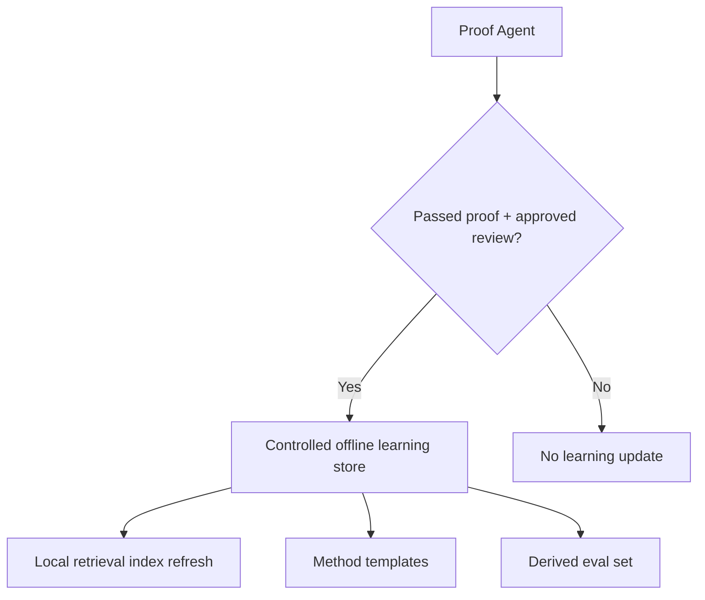
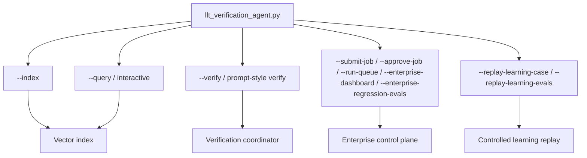

# LLT Verification Agent

This repository contains a requirement-centric, coordinator-led, RAG-backed multi-agent verification system with controlled offline learning, tenant-scoped enterprise queueing, and approval-gated evidence access:

- [SKILL.md](/Users/venkateshgogula/Desktop/llt_verification/SKILL.md)
- [llt_verification_agent.py](/Users/venkateshgogula/Desktop/llt_verification/llt_verification_agent.py)
- [agent_runtime/](/Users/venkateshgogula/Desktop/llt_verification/agent_runtime)
- [agents/](/Users/venkateshgogula/Desktop/llt_verification/agents)
- [references/](/Users/venkateshgogula/Desktop/llt_verification/references)
- [references/poolside-verification-playbook.md](/Users/venkateshgogula/Desktop/llt_verification/references/poolside-verification-playbook.md)
- [references/poolside-prompts/](/Users/venkateshgogula/Desktop/llt_verification/references/poolside-prompts)
- [references/legacy-extraction-prompts/](/Users/venkateshgogula/Desktop/llt_verification/references/legacy-extraction-prompts)
- [requirements.txt](/Users/venkateshgogula/Desktop/llt_verification/requirements.txt)

## Current Version Summary

- Requirement-centric verification is the default.
- The coordinator orchestrates multi-agent stages for requirement extraction, evidence retrieval, normalization, analysis, method selection, artifact generation, traceability, execution, debug, review, and proof.
- Repo evidence retrieval is RAG-backed with both semantic and exact keyword or symbol matching, and every hit carries file and line citations.
- Direct vs Hybrid selection is evidence-driven, not guessed.
- Controlled offline learning stores only approved, passed runs, then reuses successful patterns for similar requirements.
- Enterprise queueing is tenant-scoped and RBAC-gated with submit, approve, run, dashboard, and regression entrypoints.
- Implementation/source reads stay approval-gated and audit logged.
- Legacy extraction prompts are a fallback inside requirement extraction, not a separate runtime stage.
- Debug is a bounded self-healing loop, not unbounded self-healing.

## Current Version Architecture

### Runtime Verification

### Enterprise Control Plane

### Controlled Learning

### CLI Entrypoints

## Technical Stack

- LLM: Poolside `laguna_m_fp8_fp8kv_re_04_2026` model
- Embeddings: Local HuggingFace `BAAI/bge-m3` for dense retrieval in the current FAISS index
- Vector Store: FAISS with semantic plus exact keyword/symbol evidence ranking
- Frameworks: LangChain community components and `langchain-huggingface`
- Runtime: coordinator-led multi-agent stages with typed package handoffs
- Fallback extraction: legacy prompt bundle under `references/legacy-extraction-prompts/` for classification, IO extraction, expression extraction, math extraction, and format extraction when the deterministic parser leaves gaps
- Poolside playbook: `references/poolside-verification-playbook.md` is the default system prompt contract for every Poolside call in the runtime
- Poolside stage prompts: `references/poolside-prompts/` adds stage-specific instructions for extraction, evidence, artifacts, review, proof, and repair
- Policy: requirement-only verification by default; implementation/source reads require explicit exception approval via `LLT_IMPLEMENTATION_READ_APPROVED=1` or `--allow-implementation-reads`
- Enterprise control plane: tenant-scoped queueing, approval workflow, async execution, dashboards, and regression eval reports are available through `llt_verification_agent.py`

## Agent Shape

- Coordinator entrypoint: `llt_verification_agent.py`
- Coordinator: `agent_runtime/coordinator.py`
- Multi-agent stages: `agent_runtime/stages/`
- Message/state helpers: `agent_runtime/message.py`, `agent_runtime/state.py`, `agent_runtime/validators.py`
- Stage configs: `agents/*.yaml`

## How To Use

- Start with [SKILL.md](/Users/venkateshgogula/Desktop/llt_verification/SKILL.md)
- Read [references/flow.md](/Users/venkateshgogula/Desktop/llt_verification/references/flow.md) for the multi-agent flow
- Read [references/policy.md](/Users/venkateshgogula/Desktop/llt_verification/references/policy.md) for allowed evidence sources and approval gates
- Use `python llt_verification_agent.py --index` to build the repo index
- Use `python llt_verification_agent.py "verify requirement FAF-LLR-401"` for the prompt-style agent invocation
- Use `python llt_verification_agent.py --query "verify requirement FAF-LLR-401"` for a RAG-backed question
- Use `python llt_verification_agent.py --interactive` for chat mode
- Use `python llt_verification_agent.py --verify "verify requirement FAF-LLR-401"` for the full verification flow
- Use `python llt_verification_agent.py --submit-job "verify requirement FAF-LLR-401"` to queue enterprise work
- Use `python llt_verification_agent.py --approve-job job-20260627-0001` and `python llt_verification_agent.py --run-queue` to approve and execute queue items
- Use `python llt_verification_agent.py --enterprise-dashboard` and `--enterprise-regression-evals` for tenant-scoped control-plane output

## Notes

- Requirement-only verification is the default operating mode.
- Implementation/source reads are exception-gated and audit logged.
- Poolside is the only runtime backend.
- Direct and Hybrid are method branches inside the multi-agent workflow.
- Evidence hits include file paths and line references for auditability.
- The reviewer is the final quality gate before the proof report is accepted.
- The requirement stage may consult the legacy prompt bundle only as a fallback when the deterministic parser cannot safely recover classification, IO variables, expressions, math, or format details.
