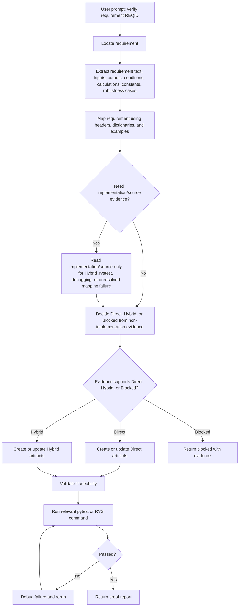

# End-To-End Flow

1. Read the user prompt as either a requirement ID or requirement text.
2. Locate the requirement text when an ID is given.
3. Extract the requirement text, inputs, outputs, conditions, calculations, constants, and robustness cases.
4. Map the requirement to code:
   - search headers for candidate functions and types
   - search source files only when needed for Hybrid `.rvstest`, debugging, or unresolved mapping failures
   - identify the component, function, signature, inputs, outputs, pointers, structs, globals, constants, and stubs
5. Map the requirement using extracted requirement text, inputs, outputs, headers, and source dictionaries:
   - search `requirements/data_dictionaries(ry)/*.csv`
   - search the data dictionary and UUT dictionary files under `verification/test-procedures/procedure-data`
   - identify missing entries that must be created
6. Check existing examples only for style, naming, and structure.
7. Decide the method:
   - Direct when the path is simple and evidence-backed
   - Hybrid when `.rvstest` behavior, dd_ variables, or complex setup is needed
   - Blocked only when evidence or execution cannot be proven
8. Create or update the artifacts that the chosen method needs:
   - If Direct is chosen:
     - `verification/test-procedures/procedure-data/data_dictionary.yaml`
     - `verification/test-procedures/procedure-data/data_dictionary.csv`
     - `verification/test-procedures/procedure-data/uut_dictionary.yaml`
     - `verification/test-procedures/procedure-data/uut_dictionary.csv`
     - `verification/test-procedures/procedure-data/types_struct.csv` only when needed, and only for Direct method
     - `records/rbtca/low_level/FAF-LLR-xxx.yaml`
     - `verification/test-cases/low_level/test_FAF-LLR-xxx.py`
   - If Hybrid is chosen:
     - `verification/test-procedures/procedure-data/data_dictionary.yaml`
     - `verification/test-procedures/procedure-data/data_dictionary.csv`
     - no `uut_dictionary.yaml`
     - no `uut_dictionary.csv`
     - no `types_struct.csv`
     - the `.rvstest` file
     - `records/rbtca/low_level/FAF-LLR-xxx.yaml`
     - `verification/test-cases/low_level/test_FAF-LLR-xxx.py`
     - in the `.rvstest` file, use `dd_` prefixed verification identifiers such as `dd_donkey`
     - in `data_dictionary.yaml` and `data_dictionary.csv`, keep the base name without the `dd_` prefix, such as `donkey`
9. Validate traceability between the requirement, RBTCA, Python tests, and dictionaries.
10. Run the relevant pytest or RVS command and capture the result.
11. Debug failures only when the failure is actionable and evidence-backed.
12. Return a proof report with the requirement mapping, source mapping, data mapping, method decision, files changed, commands run, test results, and final status.
