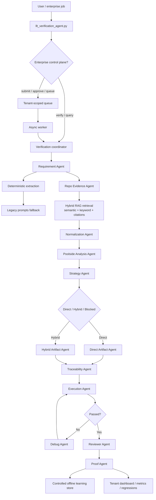

# End-To-End Flow

## Current Runtime Settings

- Poolside base URL comes from `POOLSIDE_BASE_URL` in `.env`
- Poolside API key comes from `POOLSIDE_API_KEY` in `.env`
- Poolside model is `laguna_m_fp8_fp8kv_re_04_2026`
- Embeddings use `BAAI/bge-m3`
- Vector search uses FAISS over the repository index with hybrid semantic plus exact keyword/symbol retrieval

## Current Version Architecture

1. Read the user prompt as a requirement ID or requirement text.
2. Locate the requirement when an ID is given.
3. Extract requirement text, inputs, outputs, bold terms, conditions, calculations, constants, and robustness cases.
4. If the deterministic parser leaves gaps, use the legacy extraction prompts as a fallback for classification, IO variables, expressions, math, and formatting.
5. Search repo evidence from requirement files and dictionary CSV/YAML files by default; source code or header reads require an approved exception and must be audit logged. Every retrieved evidence chunk should include its file path and line range.
6. Normalize the extracted terms so they can be reused consistently across evidence, strategy, and artifact generation.
7. Use Poolside to summarize the evidence and reinforce the verification path.
8. Decide Direct, Hybrid, or Blocked from evidence:
   - Direct only when the UUT dictionary proves a single step function, at most one init function, and normal flow.
   - Hybrid when the evidence proves complex data handling, array/procedure-vector behavior, or other non-linear setup.
   - Block when the requirement, UUT dictionary, or evidence package cannot prove a safe branch.
9. Create or update the artifacts required by the selected method.
   - Direct: update `data_dictionary.csv`, `data_dictionary.yaml`, `uut_dictionary.csv`, `uut_dictionary.yaml`, and `types_struct.csv` only if needed, then generate RBTCA and Python tests.
   - Hybrid: update `data_dictionary.csv` and `data_dictionary.yaml`, then generate the `.rvstest` procedure vector, RBTCA, and Python tests.
10. Validate traceability between requirement, dictionaries, RBTCA, `.rvstest` when present, and Python test cases.
11. Run pytest or RVS as appropriate and capture the command output.
12. Debug only when the failure is actionable and evidence-backed.
13. Let the reviewer agent inspect the requirement, source evidence, dictionaries, and generated files before final proof.
14. If the proof report passes and auto-learning is explicitly approved, store the run as a structured learning case, write a method-specific template, refresh the derived eval set, and update the local retrieval index offline.
15. Surface reuse candidates only when they clear the learned similarity threshold and confidence gate.
16. Replay approved learned cases offline with `--replay-learning-case` or `--replay-learning-evals` without re-enabling auto-learning.
17. For enterprise usage, submit jobs to the tenant-scoped queue, require approval before execution, run approved jobs asynchronously, and publish tenant-scoped dashboards and regression metrics.
18. Return a proof report with requirement mapping, source mapping, data mapping, method decision, files changed, commands run, test results, review result, learning result if any, and final status.
