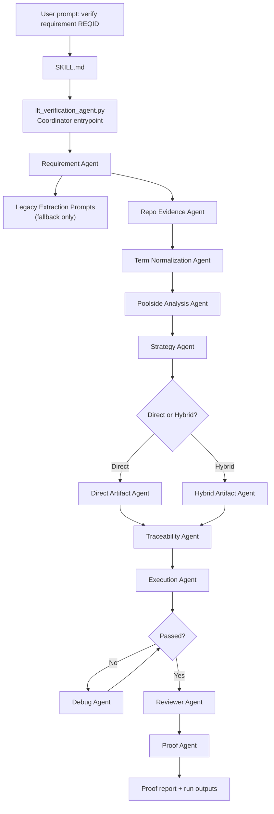

# End-To-End Flow

## Current Runtime Settings

- Poolside base URL comes from `POOLSIDE_BASE_URL` in `.env`
- Poolside API key comes from `POOLSIDE_API_KEY` in `.env`
- Poolside model is `laguna_m_fp8_fp8kv_re_04_2026`
- Embeddings use `BAAI/bge-m3`
- Vector search uses FAISS over the repository index

## Peer-Agent Architecture

1. Read the user prompt as a requirement ID or requirement text.
2. Locate the requirement when an ID is given.
3. Extract requirement text, inputs, outputs, bold terms, conditions, calculations, constants, and robustness cases.
4. If the deterministic parser leaves gaps, use the legacy extraction prompts as a fallback for classification, IO variables, expressions, math, and formatting.
5. Search repo evidence from source code, headers, requirement files, and dictionary CSV/YAML files, including source data dictionaries such as `function.csv` and `enum.csv` when present.
6. Normalize the extracted terms so they can be reused consistently across evidence, strategy, and artifact generation.
7. Use Poolside to summarize the evidence and reinforce the verification path.
8. Decide Direct, Hybrid, or Blocked from evidence, not from guesses or repo style alone.
9. Create or update the artifacts required by the selected method.
10. Validate traceability between requirement, dictionaries, RBTCA, and Python test cases.
11. Run pytest or RVS as appropriate and capture the command output.
12. Debug only when the failure is actionable and evidence-backed.
13. Let the reviewer agent inspect the requirement, source evidence, dictionaries, and generated files before final proof.
14. Return a proof report with requirement mapping, source mapping, data mapping, method decision, files changed, commands run, test results, review result, and final status.
